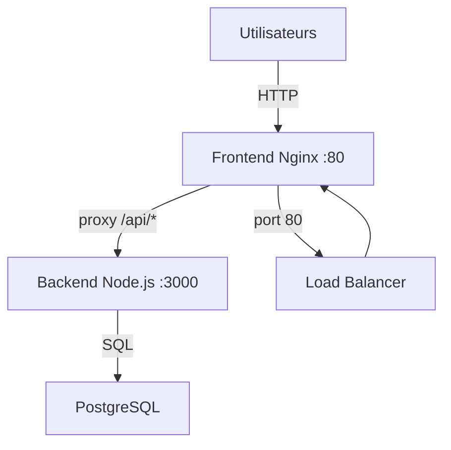

# VitalSync

Application de suivi médical et sportif conteneurisée avec une chaîne CI/CD complète.

## Architecture

L'application se compose de trois services :
- **Backend** : API REST Node.js/Express exposée sur le port 3000
- **Frontend** : interface React servie par Nginx sur le port 80
- **Database** : PostgreSQL pour la persistance des données

Les services communiquent via un réseau bridge Docker dédié. Le frontend proxifie les requêtes /api/* vers le backend via Nginx.

## Prérequis

- Docker >= 24.0
- Docker Compose >= 2.0
- Git >= 2.40
- Node.js >= 20 (uniquement pour le développement local sans Docker)

## Lancer l'application en local

Cloner le projet :

git clone https://github.com/TON_USERNAME/vitalsync.git
cd vitalsync

Créer le fichier .env à partir du template :

cp .env.example .env

Modifier les valeurs dans .env puis lancer les services :

docker compose up --build

L'application est accessible sur :
- Frontend : http://localhost:80
- Backend API : http://localhost:3000
- Health check : http://localhost:3000/health

Arrêter les services :

docker compose down

## Pipeline CI/CD

La pipeline GitHub Actions se déclenche automatiquement sur :
- Chaque push sur la branche develop
- Chaque Pull Request vers main

Elle comporte trois jobs exécutés séquentiellement :

1. Lint and Test : vérifie la qualité du code avec ESLint et exécute les tests unitaires Jest. Si ce job échoue, les suivants ne s'exécutent pas.

2. Build and Push : construit les images Docker du backend et du frontend, les tague avec le SHA du commit et les pousse vers Docker Hub.

3. Deploy to staging : recrée l'environnement de staging via docker compose, attend que le backend soit prêt et effectue un health check sur /health. La pipeline échoue si le health check ne répond pas.

## Choix techniques

- **Node.js 20 + Alpine** : image légère pour réduire la taille des conteneurs et limiter la surface d'attaque
- **Multi-stage build** : sépare l'environnement de build/test de l'image de production finale
- **GitHub Actions** : intégration native avec GitHub, runners gratuits pour les repos publics
- **Docker Hub** : registry public gratuit, compatible nativement avec docker compose
- **Azure Service Bus** : message broker pour la communication asynchrone entre le backend et le service de notifications
- **Conventional Commits** : standardise les messages de commit pour faciliter la génération de changelogs

## Schéma d'architecture

## Structure du projet

vitalsync/
├── backend/
│   ├── server.js
│   ├── package.json
│   ├── Dockerfile
│   ├── .eslintrc.json
│   └── test/
│       └── health.test.js
├── frontend/
│   ├── index.html
│   ├── nginx.conf
│   └── Dockerfile
├── k8s/
│   ├── backend-deployment.yaml
│   ├── backend-service.yaml
│   ├── frontend-ingress.yaml
│   └── secret.yaml
├── .github/
│   └── workflows/
│       └── ci-cd.yml
├── docker-compose.yml
├── .env.example
└── .gitignore